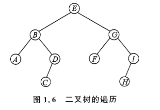

# 1. 基础数据结构&算法

## 1.1 基础数据结构

### 1.1.1 链表

可以用C++的STL list, 也可以手搓链表(动态&静态)，下面我会写一下基本的框架以及一道例题(洛谷P1996)。题目如下：

**P1996 约瑟夫问题**

*n 个人围成一圈，从第一个人开始报数，数到 m 的人出列，再由下一个人重新从 1 开始报数，数到 m 的人再出圈，依次类推，直到所有的人都出圈，请输出依次出圈人的编号。*

#### 动态链表

使用结构体去表示一个节点，然后用指针把他们连接起来就好(这里使用单向链表)。

```cpp
#include <bits/stdc++.h>
using namespace std;
struct node{
    int value;
    node* next;
};
int main(){
    // int n,m; cin>>n>>m;
    node *head, *cur,*p;
    head=new node;
    head->value=1;
    head->next=NULL;
    cur=head;
    //创建循环链表
    for(int i=2;i<=n;i++){
        p=new node;
        p->value=i;
        p->next=NULL;
        cur->next=p;
        cur=p;
    }
    cur->next=head;
    
    //题目的具体解答
    cur=head;
    node *prev; prev=head;
    while(n>1){
        for(int i=1;i<m;i++){
            prev=cur;
            cur=cur->next;
        }
        //cout<<cur->value;
        prev->next=cur->next;
        delete cur;
        cur=prev->next;
        n--;
    }
    //cout<<cur->value;
    delete cur;

    return 0;
}
```

#### 静态链表

##### 结构体数组实现单向链表

```cpp
#include <bits/stdc++.h>
using namespace std;
const int N=1000;
struct node{
    int value,next;
}nodes[N];
int main(){
    //int n,m; cin>>n>>m;
    nodes[0].next=1;
    for(int i=1;i<=n;i++){
        nodes[i].value=i;
        nodes[i].next=i+1;
    }
    nodes[n].next=1;
    //题目的具体解答
    int cur=1,prev=1;
    while(n>1){
        for(int i=0;i<m-1;i++){
            prev=cur;
            cur=nodes[cur].next;
        }
        //cout<<nodes[cur].value;
        nodes[prev].next=nodes[cur].next;
        cur=nodes[prev].next;
        n--;
    }
    //cout<<nodes[cur].value;
    return 0;
}
```

##### 结构体数组实现双向链表

```cpp
#include <bits/stdc++.h>
using namespace std;
const int N=1000;
struct node{
    int value,next,prev;
}nodes[N];
int main(){
    //int n,m; cin>>n>>m;
    nodes[0].next=1;
    for(int i=1;i<=n;i++){
        nodes[i].value=i;
        nodes[i].next=i+1;
        nodes[i].prev=i-1;
    }
    nodes[n].next=1;
    nodes[1].prev=n;
    //题目的具体解答
    int cur=1;
    while(n>1){
        for(int i=0;i<m-1;i++){
            cur=nodes[cur].next;
        }
        //cout<<nodes[cur].value;
        nodes[nodes[cur].prev].next=nodes[cur].next;
        nodes[nodes[cur].next].prev=nodes[cur].prev;
        cur=nodes[cur].next;
        n--;
    }
    //cout<<nodes[cur].value;
    return 0;
}
```

##### 一维数组实现单向链表

```cpp
#include <bits/stdc++.h>
using namespace std;
int nodes[1000];
int main(){
    //int n,m; cin>>n>>m;
    for(int i=1;i<n;i++){
        nodes[i]=i+1;
    }
    nodes[n]=1;
    int cur=1,prev=1;
    while(n>1){
        for(int i=0;i<m;i++){
            prev=cur;
            cur=nodes[cur];
        }
        nodes[prev]=nodes[cur];
        cur=nodes[cur];
        n--;
    }
    cout<<cur;
    return 0;
}
```

#### STL 链表

```cpp
#include <bits/stdc++.h>
using namespace std;
int main(){
    //int n,m;cin>>n>>m;
    list<int> nodes;
    for(int i=1;i<=n;i++){
        nodes.push_back(i);
    }
    auto it=nodes.begin();
    while(nodes.size()>1){
        for(int i=0;i<m-1;i++){
            it++;
            if(it==nodes.end()) it=nodes.begin();
        }
        // cout<<*it;
        auto next=++it;
        if(next==nodes.end()) next=nodes.begin();
        nodes.erase(--it);
        it=next;
    }
    //cout<<*it;
    return 0;
}
```

### 1.1.2 队列

#### STL queue

```cpp
queue<Type> q; //定义
q.push(item);  //进队
q.pop();       //出队
q.front();     //return 队头
q.back();      //return 队尾
q.size();      //size
q.empty();     //empty?
```

#### 双端队列

```cpp
deque<Type> dq;
dq[i];
dq.front();
dq.back();
dq.pop_front();
dq.pop_back();
dq.push_front(e);
dq.push_back(e);
```

#### 单调队列/滑动窗口

* 单调队列其实就是你一直在维持一个有序的队列,你可以很方便地知道队列里的最大值和最小值。
* 滑动窗口其实就是一个不断进队出队的过程(维持一个窗口)

这里给一个例题:
**P1886 【模板】单调队列 / 滑动窗口**

有一个长为 $n$ 的序列 $a$，以及一个大小为 $k$ 的窗口。现在这个窗口从左边开始向右滑动，每次滑动一个单位，求出每次滑动后窗口中的最小值和最大值。

例如，对于序列 $[1,3,-1,-3,5,3,6,7]$ 以及 $k = 3$，有如下过程：

| 窗口位置 | 最小值 | 最大值 |
| :--- | :---: | :---: |
| `[1   3  -1] -3   5   3   6   7` | -1 | 3 |
| `1  [3  -1  -3]  5   3   6   7` | -3 | 3 |
| `1   3 [-1  -3   5]  3   6   7` | -3 | 5 |
| `1   3  -1 [-3   5   3]  6   7` | -3 | 5 |
| `1   3  -1  -3  [5   3   6]  7` | 3 | 6 |
| `1   3  -1  -3   5  [3   6   7]` | 3 | 7 |

**解答：**

```cpp
#include <bits/stdc++.h>
using namespace std;
int main(){
    int n,k; cin>>n>>k;
    vector<int> a(n);
    deque<int> q;
    for(int i=0;i<n;i++){
        cin>>a[i];
    }
    for(int i=0;i<n;i++){
        while(!q.empty() && a[q.back()]>a[i]) q.pop_back();
        q.push_back(i);
        if(i>=k-1){
            while(!q.empty() && i-q.front()+1>k) q.pop_front();
            cout<<a[q.front()]<<" ";
        }
    }
    cout<<endl;
    while(!q.empty()) q.pop_front();
    for(int i=0;i<n;i++){
        while(!q.empty() && a[q.back()]<a[i]) q.pop_back();
        q.push_back(i);
        if(i>=k-1){
            while(!q.empty() && i-q.front()+1>k) q.pop_front();
            cout<<a[q.front()]<<" ";
        }
    }
    return 0;
}
```

### 1.1.3 栈

```cpp
stack<Type> s;
s.push(item);
s.top();
s.pop();
s.size();
s.empty();
```

同理我们也有单调栈，和单调队列一样我们需要维持队列的有序

**P2947 [USACO09MAR] Look Up S**

**约翰的 $N(1\le N\le10^5)$ 头奶牛站成一排，奶牛 $i$ 的身高是 $H_i(1\le H_i\le10^6)$。现在，每只奶牛都在向右看。对于奶牛 $i$，如果奶牛 $j$ 满足 $i<j$ 且 $H_i<H_j$，我们可以说奶牛 $i$ 可以仰望奶牛 $j$。 求出每只奶牛离她最近的仰望对象。**

```cpp
#include <bits/stdc++.h>
using namespace std;
int main(){
    int n; cin>>n;
    vector<int> cows(n+1),res(n+1);
    stack<int> st;
    for(int i=1;i<=n;i++) cin>>cows[i];
    for(int i=n;i>=1;i--){
        while(!st.empty() && cows[i]>=cows[st.top()]) st.pop();
        if(st.empty()) res[i]=0;
        else res[i]=st.top();
        st.push(i);
    }
    for(int i=1;i<=n;i++){
        cout<<res[i]<<endl;
    }
    return 0;
}
```

### 1.1.4 二叉树&哈夫曼树

#### 动态二叉树

```cpp
#include <bits/stdc++.h>
using namespace std;
struct Node{
    int value;
    Node *left,*right;
};
int main(){
    return 0;
}
```

#### 静态二叉树

```cpp
#include <bits/stdc++.h>
using namespace std;
const int N=1000;
struct Node{
    int value;
    int left,right;
}Nodes[N];
int main(){
    return 0;
}
```

#### 更简洁的表示完全二叉树

假设根节点是1，后续节点：2,3,4,...,k. 那么：

* 节点 $i(i>1)$ 的父节点为：`i/2`;
* 若 $2*i>k$，节点 $i$ 没有叶子节点；若 $2*i+1>k$，节点 $i$ 没有右子节点
* 若节点 $i$ 有右子节点，那么它的左子节点为 $2*i$，右子节点为 $2*i+1$

#### 二叉树遍历

拿一个图来举例，如下：



* BFS: `E-BG-ADFI-CH`

```cpp
//动态二叉树Node
void BFS(Node* start){
    if(start==nullptr) return;
    queue<Node*> q;
    q.push(start);
    while(!q.empty()){
        Node* u=q.front();
        q.pop();
        cout<<u->value;
        if(u->left) q.push(u->left);
        if(u->right) q.push(u->right);
    }
}
```

* DFS(preorder): `EBADCGFIH`

```cpp
//动态二叉树Node
void preorder(Node* start){
    if(start==nullptr) return;
    cout<<start->value;
    preorder(start->left);
    preorder(start->right);
}
```

* DFS(inorder): `ABCDEFGHI`

```cpp
//动态二叉树Node
void inorder(Node* start){
    if(start==nullptr) return;
    inorder(start->left);
    cout<<start->value;
    inorder(start->right);
}
```

* DFS(postorder): `ACDBFHIGE`

```cpp
//动态二叉树Node
void postorder(Node* start){
    if(start==nullptr) return;
    postorder(start->left);
    postorder(start->right);
    cout<<start->value;
}
```

#### 哈夫曼树 & 哈夫曼编码

二叉树越平衡，树的路径长度(根节点到每个叶子节点的距离之和)是越短的,然而这里是默认不带权的，如果链接节点之间的边带权，那么一个平衡的二叉树的路径长度未必是最小的。所以这就是哈夫曼树需要去解决的，步骤如下：

* 把每个权值构造成一棵只有一个节点的树，$n$ 个权值构成了 $n$ 棵树，记为集合 $F = \{T_1, T_2, \cdots, T_n\}$
* 在 $F$ 中选择权值最小的两棵树 $T_i$ 和 $T_j$，合并为一棵新的二叉树 $T_x$，它的权值等于 $T_i$ 与 $T_j$ 的权值之和，左右子树分别为 $T_i$ 和 $T_j$
* 在 $F$ 中删除 $T_i$ 和 $T_j$，并把 $T_x$ 加入 $F$
* 重复步骤（2）和步骤（3），直到 $F$ 中只含有一棵树，这棵树就是哈夫曼树

#### P1087 [NOIP 2004 普及组] FBI 树

##### 题目描述

我们可以把由 0 和 1 组成的字符串分为三类：全 0 串称为 B 串，全 1 串称为 I 串，既含 0 又含 1 的串则称为 F 串。

FBI 树是一种二叉树，它的结点类型也包括 F 结点，B 结点和 I 结点三种。由一个长度为 $2^N$ 的 01 串 $S$ 可以构造出一棵 FBI 树 $T$，递归的构造方法如下：

1. $T$ 的根结点为 $R$，其类型与串 $S$ 的类型相同；
2. 若串 $S$ 的长度大于 $1$，将串 $S$ 从中间分开，分为等长的左右子串 $S_1$ 和 $S_2$；由左子串 $S_1$ 构造 $R$ 的左子树 $T_1$，由右子串 $S_2$ 构造 $R$ 的右子树 $T_2$。

现在给定一个长度为 $2^N$ 的 01 串，请用上述构造方法构造出一棵 FBI 树，并输出它的后序遍历序列。

##### 输入格式

第一行是一个整数 $N(0 \le N \le 10)$，

第二行是一个长度为 $2^N$ 的 01 串。

##### 输出格式

一个字符串，即 FBI 树的后序遍历序列。

##### 输入输出样例 #1

##### 输入 #1

```text
3
10001011
```

###### 输出 #1

```text
IBFBBBFIBFIIIFF

```

###### 说明/提示

对于 $40\%$ 的数据，$N \le 2$；
对于全部的数据，$N \le 10$。

```cpp
#include <bits/stdc++.h>
using namespace std;
typedef long long ll;
struct Node{
    char v;
    Node* left;
    Node* right;
};
void postorder(Node* start){
    if(start==nullptr) return;
    postorder(start->left);
    postorder(start->right);
    cout<<start->v;
}
vector<int> N={1,2,4,8,16,32,64,128,256,512,1024};
int main(){
    int n; cin>>n;
    int len=N[n];
    Node* m;
    string str;
    cin>>str;
    queue<Node*> q;
    for(char c : str){
        m = new Node;
        if(c=='0') m->v='B';
        else m->v='I';
        m->left=nullptr;
        m->right=nullptr;
        q.push(m);
    }
    while(q.size()!=1){
        Node* node1=q.front(); q.pop();
        Node *node2=q.front(); q.pop();
        m=new Node;
        if(node1->v=='B' && node2->v=='B') m->v='B';
        else if(node1->v=='I' && node2->v=='I')m->v='I';
        else m->v='F';
        m->left=node1;
        m->right=node2;
        q.push(m);
    }
    postorder(q.front());
    return 0;
}
```

### 1.1.5 堆

#### 二叉堆手写代码（小根堆）

```cpp
#include <bits/stdc++.h>
using namespace std;
typedef long long ll;
const int N=1e6+5;
int heap[N], len=0;
//上浮
void push(int x){
    heap[++len]=x;
    int i=len;
    while(i>1 && heap[i]<heap[i/2]){
        swap(heap[i],heap[i/2]);
        i/=2;
    }
}
//下沉
void pop(){
    heap[1]=heap[len--];
    int i=1;
    while(2*i<=len){
        int son=2*i;//选中左儿子
        if(son<len && heap[son+1]<heap[son]){
            //看有没有右儿子，并选中儿子中较小的那一个
            son++;
        }
        if(heap[son]<heap[i]){
            swap(heap[son],heap[i]);
            i=son;
        }
        else break;
    }
}
int main(){
    int n; cin>>n;
    while(n--){
        int operation; cin>>operation;
        if(operation==1){
            //进堆
            int x; cin>>x;
            push(x);
        }
        else if(operation==2){
            //出堆
            cout<<heap[1];
        }
        else{
            pop();
        }
    }
    return 0;
}
```

#### 优先队列

```cpp
priority_queue<int, vector<int>, greater<int>> pq;  // 小根堆
priority_queue<int> pq;                              // 大根堆（默认）
pq.push(x);   // 进堆
pq.pop();     // 出堆
pq.top();     // 返回堆顶
pq.size();    // 大小
pq.empty();   // 判空
```

## 1.2 基本算法

### 1.2.1 尺取法&二分法&三分法

#### 尺取法

尺取法其实能听懂一点讲就是双指针，一般是在下面的情境下去用的：

* *给定一个序列，首先需要它是有序的*
* *问题和序列的区间有关,需要操作两个变量(下标i,j)来进行区间的扫描*

一个很经典的例子就是**两数之和**，这场找一个区间的目标两数之和应该是这个样子

```cpp
for(int i=0;i<n;i++){
    for(int j=n-1;j>i;j--){
        //check nums[i] + nums[j]==target?
    }
}
```

使用尺取法的话只需要

```cpp
int i=0,j=n-1;
while(i<j){
    //check nums[i]+nums[j]==target?
    if(nums[i]+nums[j]>target){
        j--;
    }
    else if(nums[i]+nums[j]<target){
        i++;
    }
    else{
        //find the answer
    }
}
```

这个双指针通常可以分成**反向(i头扫尾，j尾扫头，如判断回文串)**和**同向(我们所熟知的滑动窗口，如算区间和，数组去重等)**的

#### 二分法

##### 整数二分

```cpp
int binary_search(int* a, int n, int x){
    int left=0,right=n;
    while(left<right){
        int mid=left+(right-left)/2;
        if(a[mid]>=x){
            right=mid;
        }
        else{
            left=mid+1;
        }
    }
}
```

**例题：** 

有一个序列 $\{2, 2, 3, 4, 5, 1\}$，将其划分成 3 个连续的子序列 $S_1$、$S_2$、$S_3$，每个子序列最少有一个元素，要求使每个子序列的和的最大值最小。下面举例两种分法。

* **分法 1**：$S_1$、$S_2$、$S_3$ 分别为 $(2, 2, 3)$、$(4, 5)$、$(1)$，子序列和分别为 $7$、$9$、$1$，最大值为 $9$。
* **分法 2**：$S_1$、$S_2$、$S_3$ 分别为 $(2, 2, 3)$、$(4)$、$(5, 1)$，子序列和分别为 $7$、$4$、$6$，最大值为 $7$。

可见分法 2 更好。

```cpp
#include <bits/stdc++.h>
using namespace std;
typedef long long ll;
bool check(const vector<ll>& nums,int m,int x){
    ll current_sum=0;
    int partition=1;
    for(ll num:nums){
        if(current_sum+num>x){
            partition++;
            current_sum=num;
        }
        else{
            current_sum+=num;
        }
    }
    return partition<=m;
}
int main(){
    int n,m; cin>>n>>m;
    vector<ll> nums(n);
    ll upper=lower=0;
    for(int i=0;i<n;i++) cin>>nums[i];
    for(ll num:nums){
        lower=max(lower,num);
        upper+=num;
    }
    ll ans=upper;
    while(lower<=upper){
        ll mid=lower+(upper-lower)/2;
        if(check(nums,m,mid)){
            ans=mid;
            upper=mid-1;
        }
        else{
            lower=mid+1;
        }
    }
    cout<<ans;
    return 0;
}
```

##### 实数二分

a

##### 整数三分

##### 实数三分

#### 三分法

### 1.2.2 倍增法&ST算法

### 1.2.3 前缀和&差分

### 1.2.4 离散化

### 1.2.5 分治法

### 1.2.6 贪心法 & 拟阵

### 1.2.7 排序 & 排列
